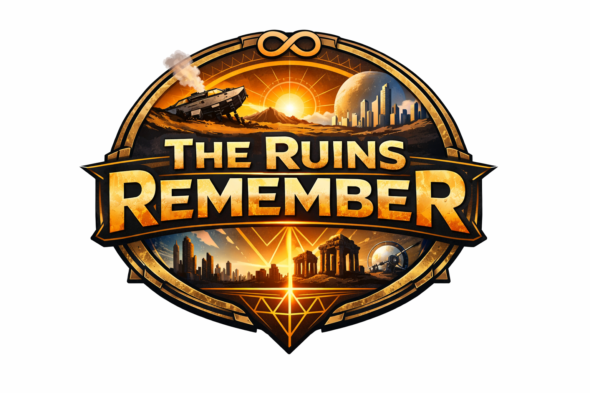

<p align="center">
  
</p>

<h1 align="center">The Ruins Remember</h1>

<p align="center">
  <strong><a href="https://langui.sh/theruinsremember">Play it now</a></strong>
</p>

An incremental/idle game about the last survivors of humanity crash-landing on a new planet and rebuilding civilization from scratch — only to discover that someone has done all of this before.

## The Story

Survivors of the Great Collapse establish humanity's last hope on an untamed world. As they build, they find strange metal in the soil. Geometric patterns in the bedrock. Foundations laid in perfect rows beneath millennia of dirt. The ruins are too precise, too familiar.

Across 10 eras — from Planetfall through Industrialization, the Digital Age, the Space Age, and beyond to the Multiverse — the player uncovers a single terrible truth: every civilization reaches this point. Every civilization builds these same things. Every civilization falls.

Prestige isn't just a mechanic. It's the cycle itself.

## How It Works

- **10 Eras** spanning primitive survival to multiverse exploration
- **579 upgrades** forming deep prerequisite chains with meaningful branching choices
- **115 tech nodes** including mutually exclusive paths that shape each run differently
- **Era-focused operations** that evolve from ruin expeditions into orbital missions, colony mandates, star-network directives, Dyson assembly, reality weaving, galactic politics, cosmic tuning, and the Reality Forge
- **Distinct cycle doctrines** that reshape early, middle, or late eras and award permanent cycle marks for doctrine-specific goals
- **Reality keys with different identities**: faster expeditions, larger storage, stronger operation rewards, or seeded starting resources
- **Recovered Relics** with guaranteed Echo Pressure offers and a two-slot, run-only loadout that dissolves at prestige
- **Finite orbital contracts** with approach risk, one decisive docking attempt, and permanent run payoffs instead of unlimited farming
- **30 prestige upgrades** including 5 "Ascension" tier endgame upgrades
- **270 reachable achievements** tracking everything from speed milestones to narrative discovery
- **A canvas that reflects your progress** — buildings appear as you buy upgrades, production intensity glows, weather changes, bonus orbs spawn for active players
- **Progression-gated era advancement** — new eras require sufficient upgrade depth, era-local research depth, and the starred breakthrough technology instead of passive waiting
- **Resource caps that matter** — storage is a real constraint requiring strategic cap upgrades
- **Consumption chains** — food feeds labor, energy powers electronics, fuel maintains orbital infrastructure, exotic materials sustain colonies
- **Automation cascades** — earlier eras auto-manage as you progress, shifting your focus to new challenges
- **A narrative Chronicle** collecting lore fragments, recovered signals, and codex discoveries that piece together the story of the cycle
- **A run-director UI layer** that explains what is blocking the next breakthrough instead of leaving progression hidden in raw numbers

## The Experiment

This game was built entirely through AI coding agents, primarily [Claude Code](https://docs.anthropic.com/en/docs/claude-code) and Codex. No human wrote any of the code directly. The human's role was limited to:

- Describing the initial concept and iteration plan
- Playtesting and providing feedback ("the end of era 4 takes too long", "upgrades feel pointless", "the canvas should be more relevant")
- Asking for research ("look on the internet for how best to balance incrementals")
- Requesting iterations ("do it again", "200 more iterations")
- Naming the game

Everything else — architecture, engine design, data balancing, CSS, canvas rendering, story writing, bug fixing, performance optimization, accessibility — was designed and implemented by the agent across 300+ commits and hundreds of iterative improvement cycles.

The agent researched incremental game design best practices (drawing from Cookie Clicker, Antimatter Dimensions, A Dark Room, Trimps, Synergism, and others), audited its own work repeatedly, simulated playthroughs to find dead spots, and fixed its own bugs.

The game is feature-complete and stable. If you find something broken or have a suggestion, [file an issue](https://github.com/reaperhulk/theruinsremember/issues).

## Running Locally

```bash
npm install
npm run dev
```

## Testing And Playtesting

Pure logic:

```bash
npm test -- --run
```

Complete non-browser quality gate:

```bash
npm run test:quality
```

Balance regression harness:

```bash
npm run test:balance
```

Browser smoke tests:

```bash
npm run dev
node scripts/browser-test.mjs
node scripts/browser-test.mjs --mobile
```

The browser smoke test drives a real early-game flow, exercises orbital mission
choices, fragment selection, limited tuning probes, the operation archive, all
three cycle doctrines, and an Era 10 prestige. It fails on progression misses,
console errors, or viewport overflow. Use `--prestige 1` to include a reset.

The balance harness currently validates four seeded scenarios:

- `full` for optimal completion pacing
- `casual` for a normal active run
- `lowInteraction` for low-interaction viability
- `passive` for mostly idle viability

## Recent Direction

Recent iteration work focused on:

- Presenting the current era operation prominently while keeping prior systems in an archive
- Replacing blind or solved interactions with fragment choices, signal probes, docking approaches, colony mandates, and star directives
- Making Reality Forge keys and cycle doctrines materially change the next run
- Measuring repeated actions, relic timing, economic waiting, operation latency, direct rewards, and ignored systems in the seeded playtest harness

## Tech Stack

- React + Vite
- Pure engine functions (no side effects, deterministic)
- Vitest for testing
- Puppeteer for automated browser testing
- Bot playtest system with seeded scenario assertions for balance verification
- HTML5 Canvas for animated scene
- No external runtime dependencies beyond React and Vite

## License

BSD 2-Clause. See [LICENSE](LICENSE).
